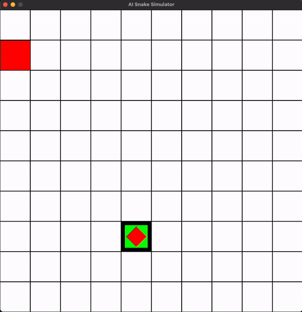

# AI Snake Simulator | Deep Q-Learning (DQN)

This project provides a simulator for the classic Snake game with support for both human players and AI agents. It includes a Deep Q-Learning implementation that tries to learn to play the game. Could you make a better one?



## Features

- Modular design allowing custom Agent implementations
- Built-in Deep Q-Learning agent using TensorFlow
- Support for both GUI and headless simulation
- Configurable game parameters
- Human playable mode

## Setup

> Note that this was built/tested with python v3.11

1. Create a virtual environment (recommended):
```bash
python -m virtualenv venv
# windows
.\venv\Scripts\activate
# mac/linux
source venv/bin/activate
```

2. Install dependencies:
```bash
pip install -r requirements.txt
```

For development, install additional dependencies:
```bash
pip install -r requirements-dev.txt
```

## Running the Simulator

The simulator can be run in several modes:

1. Human Player Mode:
```bash
python src/main.py --user
```

2. AI Training Mode:
```bash
python src/main.py --training
```

3. AI Inference Mode (using pre-trained model):

(`model` should be the path relative to the `./assets/models` directory)
```bash
python src/main.py --model model.weights.h5
```

4. Headless Training Mode:
```bash
python src/main.py --headless --training
```

### Command Line Arguments

- `--user`: Enable human player mode (arrow key controls)
- `--headless`: Run without GUI (for faster training)
- `--model`: Path to a pre-trained model
- `--training`: Enable training mode for the AI agent

## Implementing Your Own Agent

You can create custom agents by inheriting from the `Agent` base class:

```python
from agent import Agent

class MyCustomAgent(Agent):
    def __init__(self, input_shape: tuple[int, int], num_outputs: int, training: bool):
        super().__init__(input_shape, num_outputs, training)
        
    def update(self, inputs, reward_collision=False, wall_collision=False, keys_pressed=None):
        # Implement your agent's decision logic here
        # Return an action (0-3 for directions)
        pass
        
    def save_model(self, path):
        # Implement if your agent needs to save state
        pass
        
    def load_model(self, path):
        # Implement if your agent needs to load state
        pass
```

Then use your agent with the simulator:

```python
def main():
    # Create your custom agent
    agent = MyCustomAgent(input_shape=(25, 25), num_outputs=4)
    
    # Create the simulator model
    model = SimulatorModel(25, 25, agent=agent, debug=True, max_iterations=500)
    
    # Create and start the simulator
    simulator = Simulator(
        width=800, 
        height=800, 
        model=model, 
        fps=10, 
        caption="AI Snake Simulator"
    )
    simulator.start()
```

## Project Structure

- `src/agent.py`: Base Agent class and DefaultAgent implementation
- `src/qlearn.py`: Deep Q-Learning agent implementation
- `src/simulator.py`: Core simulation logic
- `src/snake.py`: Snake game mechanics
- `src/main.py`: Entry point and CLI interface
- `src/assets/models/`: Directory for saved model weights

## Contributing

Feel free to submit issues and pull requests for new features or improvements.

